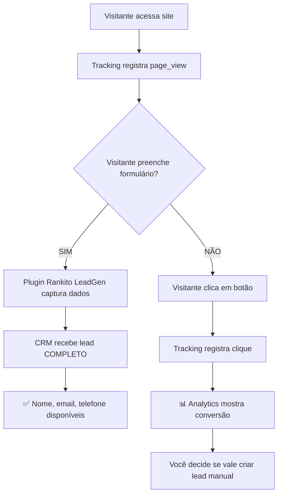
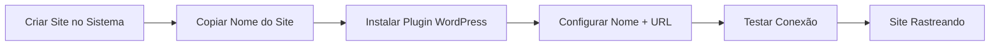
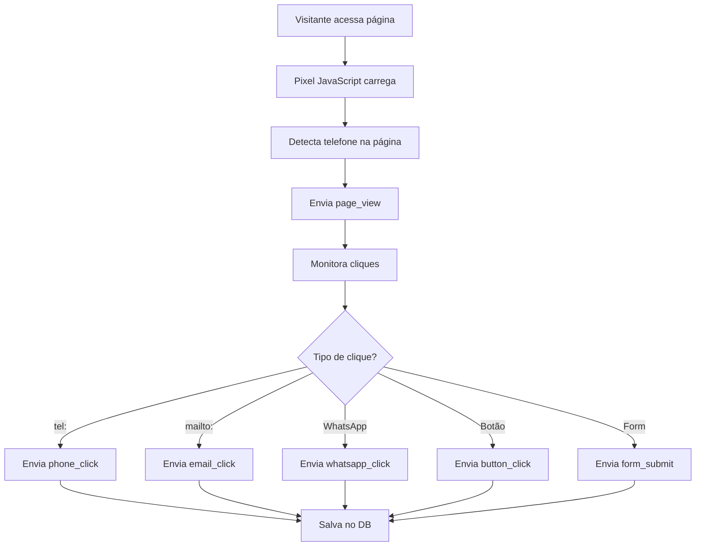
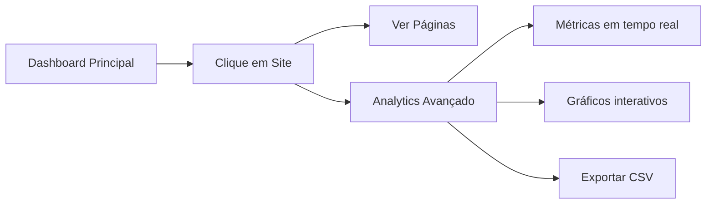

# 🎯 Sistema Rank & Rent - Guia Completo

## Visão Geral

Sistema completo para gestão de sites Rank & Rent com rastreamento automático de conversões, analytics avançado e plugin WordPress.

---

## 📦 Plugin WordPress

### O que faz o plugin?

O plugin **Rank & Rent Tracker** injeta automaticamente um código JavaScript em todas as páginas do seu site WordPress para rastrear:

- ✅ **Page Views**: Toda visualização de página
- ✅ **Cliques em Telefone**: Links `tel:` e botões de chamada
- ✅ **Cliques em Email**: Links `mailto:`
- ✅ **Cliques em WhatsApp**: Links para WhatsApp
- ✅ **Cliques em Botões**: Todos os botões e CTAs
- ✅ **Envio de Formulários**: Submissions de forms

### Instalação do Plugin

#### Passo 1: Criar o Plugin

1. Baixe o arquivo `rank-rent-tracker.zip.txt` localizado em `/public/`
2. Siga as instruções dentro do arquivo para criar a estrutura correta
3. Você precisará criar:
   - `rank-rent-tracker/rank-rent-tracker.php` (arquivo principal)
   - `rank-rent-tracker/assets/admin.css` (estilos)
   - `rank-rent-tracker/readme.txt` (documentação)

#### Passo 2: Fazer Upload

1. No WordPress, vá em **Plugins > Adicionar Novo > Enviar Plugin**
2. Faça upload do arquivo `.zip`
3. Clique em **Instalar Agora**
4. Ative o plugin

#### Passo 3: Configurar

1. Vá em **Configurações > Rank & Rent**
2. Preencha:
   - **Nome do Site**: Identificador único (ex: `meusite.com.br`)
   - **URL de Rastreamento**: URL fornecida pelo sistema
3. Clique em **Salvar Configurações**
4. Clique em **Testar Conexão** para verificar

### URL de Rastreamento

**URL Atual (Lovable - temporária):**
```
https://jhzmgexprjnpgadkxjup.supabase.co/functions/v1/track-rank-rent-conversion
```

**Para trocar para URL definitiva no futuro:**

1. No plugin WordPress, vá em **Configurações > Rank & Rent**
2. Atualize o campo **URL de Rastreamento**
3. Salve as configurações

O sistema continuará funcionando normalmente com a nova URL.

---

## 📊 Dashboard Analytics

### Acessando o Analytics

1. No dashboard principal, clique em um site
2. No topo da página, clique no botão **"Analytics Avançado"**
3. Você será redirecionado para `/dashboard/analytics/:siteId`

### Recursos do Analytics

#### 1. Cards de Métricas
- **Visitantes Únicos**: Baseado em IPs únicos
- **Visualizações**: Total de page views
- **Conversões**: Total de interações (cliques, forms)
- **Taxa de Conversão**: % de conversões sobre page views

#### 2. Gráficos Interativos

**Timeline de Eventos**
- Linha do tempo mostrando page views vs conversões
- Visualização dia a dia do período selecionado

**Distribuição de Eventos**
- Gráfico de pizza mostrando % de cada tipo de evento
- Page views, cliques em telefone, email, WhatsApp, etc.

**Top 10 Páginas**
- Gráfico de barras horizontal
- Mostra as páginas com mais eventos
- Ordenado por volume de interações

#### 3. Filtros Avançados

**Período**
- Últimos 7 dias
- Últimos 30 dias
- Últimos 90 dias
- **Personalizado**: Selecione datas específicas

**Tipo de Evento**
- Todos
- Page View
- Clique Telefone
- Clique Email
- Clique WhatsApp
- Clique Botão
- Envio Formulário

**Dispositivo**
- Todos
- Desktop
- Mobile

#### 4. Tabela de Conversões Detalhadas

**Informações exibidas:**
- Data e hora da conversão
- Tipo de evento
- Página onde ocorreu
- Texto do CTA clicado
- Dispositivo (mobile/desktop)
- IP do visitante

**Funcionalidades:**
- Paginação (20 itens por página)
- Exportar para CSV
- Filtros aplicados automaticamente

### Exportar Dados

1. Na seção **Conversões Detalhadas**
2. Clique no botão **"Exportar CSV"**
3. Arquivo será baixado com todas as conversões do período
4. Use para relatórios externos ou análise em Excel

---

## 🎯 Captura de Leads vs Analytics

### Entendendo a Diferença

O sistema possui **duas funcionalidades independentes** que muitas vezes são confundidas:

#### 1. **Tracking de Conversões (Sempre Ativo)**

**O que faz:**
- Registra **todos** os cliques e interações em seus sites
- Armazena dados de localização, device, horário, página, etc.
- Alimenta os relatórios de Analytics
- Permite análise de comportamento dos visitantes

**O que captura:**
- ✅ Página visitada
- ✅ Localização (cidade, estado, país)
- ✅ Device (mobile/desktop)
- ✅ Horário do evento
- ✅ Tipo de ação (clique telefone, WhatsApp, email, etc.)
- ❌ **NÃO captura:** nome, email, telefone do visitante

**Onde ver os dados:**
- Dashboard principal → Clique no site → **Analytics Avançado**
- Gráficos, métricas, exportação CSV

---

#### 2. **Auto-Conversão de Leads (Opcional - Desabilitado por Padrão)**

**O que faz:**
- Cria automaticamente leads no CRM baseado em cliques
- Verifica conversões a cada 5 minutos
- Atribui score e qualificação (hot/warm/cold)

**⚠️ Problema com Cliques:**
Cliques em botões (telefone, WhatsApp, email) capturam apenas:
- 📍 Localização
- 📱 Device
- ⏰ Horário
- **Mas NÃO capturam dados de contato!**

**Resultado:**
Você acaba com leads "fantasma" no CRM:
- ❌ Sem nome
- ❌ Sem email
- ❌ Sem telefone
- ❌ Impossível fazer follow-up

**✅ Solução Recomendada:**
Use o **Plugin Rankito LeadGen** para capturar formulários completos com:
- ✅ Nome completo
- ✅ Email
- ✅ Telefone
- ✅ Empresa
- ✅ Mensagem
- ✅ Qualquer campo personalizado

---

#### 3. **Plugin Rankito LeadGen (Recomendado para Leads Reais)**

**O que faz:**
- Cria formulários customizáveis no WordPress
- Captura dados completos do lead
- Cria automaticamente leads no CRM **com informações de contato**
- Integra perfeitamente com o sistema de tracking

**Workflow Ideal:**



---

### Comparação Direta

| Funcionalidade | Tracking | Auto-Conversão (Cliques) | Plugin Rankito LeadGen |
|---|---|---|---|
| **Sempre ativo?** | ✅ Sim | ❌ Não (opcional) | ✅ Sim (quando instalado) |
| **Captura localização?** | ✅ Sim | ✅ Sim | ✅ Sim |
| **Captura device?** | ✅ Sim | ✅ Sim | ✅ Sim |
| **Captura nome?** | ❌ Não | ❌ Não | ✅ Sim |
| **Captura email?** | ❌ Não | ❌ Não | ✅ Sim |
| **Captura telefone?** | ❌ Não | ❌ Não | ✅ Sim |
| **Cria leads CRM?** | ❌ Não | ✅ Sim (sem contato) | ✅ Sim (completo) |
| **Aparece em Analytics?** | ✅ Sim | ✅ Sim | ✅ Sim |
| **Útil para follow-up?** | ⚠️ Apenas análise | ❌ Não | ✅ Sim |

---

### Workflow Recomendado

#### **Etapa 1: Instalar Tracking**
1. Instalar plugin Rank & Rent Tracker em todos os sites
2. Configurar nome do site e URL de rastreamento
3. Testar conexão

**Resultado:**
✅ Analytics completo funcionando  
✅ Todas as conversões sendo registradas  

#### **Etapa 2: Desabilitar Auto-Conversão de Cliques**
1. Ir em **Configurações > Auto-Conversão**
2. Deixar switch principal **DESLIGADO**
3. Ler os avisos sobre leads sem contato

**Resultado:**
✅ CRM limpo, sem leads "fantasma"  
✅ Você controla quando criar leads  

#### **Etapa 3: Instalar Plugin Rankito LeadGen**
1. Baixar plugin Rankito LeadGen
2. Instalar no WordPress
3. Configurar token de integração
4. Criar formulários customizados

**Resultado:**
✅ Formulários capturam dados completos  
✅ Leads automaticamente no CRM com contato  
✅ Follow-up possível  

#### **Etapa 4: Analisar e Agir**
1. Monitorar Analytics diariamente
2. Ver quais páginas geram mais cliques
3. Quando ver atividade interessante, criar lead manual
4. Acompanhar leads de formulários automaticamente

**Resultado:**
✅ Decisões baseadas em dados  
✅ CRM organizado  
✅ Leads qualificados  

---

### Quando Usar Cada Funcionalidade?

#### **Use Tracking (sempre):**
- ✅ Análise de tráfego
- ✅ Identificar páginas populares
- ✅ Entender comportamento de visitantes
- ✅ Relatórios para clientes
- ✅ Otimização de SEO

#### **Use Auto-Conversão (raramente):**
- ⚠️ **Apenas** para formulários (não cliques)
- ⚠️ Quando você quer leads automáticos mesmo sem dados completos
- ⚠️ Para testes/experimentos específicos

#### **Use Plugin Rankito LeadGen (sempre que possível):**
- ✅ Captura de leads qualificados
- ✅ Formulários de contato
- ✅ Landing pages
- ✅ Páginas de serviço
- ✅ Qualquer lugar onde você quer dados completos

---

### Configuração Recomendada

**No sistema Rankito:**

```
Auto-Conversão: DESABILITADO
├─ enabled: false
├─ whatsapp_click_enabled: false
├─ phone_click_enabled: false
├─ email_click_enabled: false
└─ form_submit_enabled: true (somente se usar Plugin Rankito LeadGen)
```

**Tracking: SEMPRE ATIVO**
- Não há configuração, está sempre funcionando
- Todos os eventos são registrados automaticamente

**Plugin Rankito LeadGen: ATIVO**
- Instalado em todos os sites WordPress
- Configurado com token correto
- Formulários criados nas páginas estratégicas

---

### FAQ - Perguntas Frequentes

**Q: Se eu desabilitar auto-conversão, vou perder dados?**  
A: Não! O tracking continua registrando tudo. Você só não criará leads automaticamente.

**Q: Posso habilitar auto-conversão depois?**  
A: Sim! É só ir em Configurações > Auto-Conversão e ativar. Há também um "Modo Expert" para configurações avançadas.

**Q: O Plugin Rankito LeadGen substitui o Rank & Rent Tracker?**  
A: Não! São complementares:
- **Rank & Rent Tracker:** Rastreia todos os eventos (tracking)
- **Rankito LeadGen:** Captura formulários com dados completos

**Q: Preciso dos dois plugins instalados?**  
A: Idealmente sim:
- Rank & Rent Tracker para analytics
- Rankito LeadGen para captura de leads

**Q: Posso usar só um plugin?**  
A: Sim, mas você perde funcionalidades:
- **Só Rank & Rent Tracker:** Analytics completo, mas sem captura de formulários
- **Só Rankito LeadGen:** Captura formulários, mas sem analytics de cliques

**Q: Por que não criar leads de cliques automaticamente?**  
A: Porque cliques não têm dados de contato. Você acaba com leads "fantasma" no CRM que não pode contactar.

**Q: Quando eu deveria usar auto-conversão?**  
A: Apenas para formulários (form_submit_enabled: true). Nunca para cliques simples.

---

## 🔧 Configuração Técnica

### Variáveis de Ambiente

O sistema usa as seguintes variáveis (já configuradas):

```env
VITE_SUPABASE_URL=https://jhzmgexprjnpgadkxjup.supabase.co
VITE_SUPABASE_PUBLISHABLE_KEY=eyJhbGciOi...
VITE_SUPABASE_PROJECT_ID=jhzmgexprjnpgadkxjup
```

### Edge Function

A função `track-rank-rent-conversion` processa todos os eventos:

**Endpoint:**
```
POST /functions/v1/track-rank-rent-conversion
```

**Payload:**
```json
{
  "site_name": "meusite.com.br",
  "page_url": "https://meusite.com.br/pagina",
  "event_type": "phone_click",
  "cta_text": "Ligar Agora",
  "metadata": {
    "referrer": "https://google.com",
    "device": "mobile",
    "page_title": "Página Inicial",
    "detected_phone": "(11) 99999-9999"
  }
}
```

### Estrutura do Banco

**Tabela: `rank_rent_conversions`**
- `site_id`: UUID do site
- `page_id`: UUID da página (auto-criado se não existir)
- `page_url`: URL completa
- `page_path`: Path da URL
- `event_type`: Tipo do evento
- `cta_text`: Texto do botão/link clicado
- `metadata`: JSON com dados adicionais
- `ip_address`: IP do visitante
- `user_agent`: User agent do navegador
- `referrer`: URL de origem
- `created_at`: Timestamp da conversão

---

## 🚀 Fluxo Completo

### 1. Setup Inicial



### 2. Rastreamento Automático



### 3. Visualização de Dados



---

## 📱 Casos de Uso

### Caso 1: Monitorar Site de Advogado

1. Criar site no sistema: "advogado-sp.com.br"
2. Instalar plugin no WordPress
3. Configurar nome e URL
4. Acompanhar:
   - Quantas pessoas clicam no telefone
   - Quais páginas geram mais leads
   - Taxa de conversão por dispositivo
   - Horários de pico de conversões

### Caso 2: Relatório para Cliente

1. Acessar Analytics do site
2. Selecionar período (ex: últimos 30 dias)
3. Visualizar métricas principais
4. Exportar CSV com conversões detalhadas
5. Criar apresentação com dados

### Caso 3: Otimizar Performance

1. Ver Top 10 Páginas no Analytics
2. Identificar páginas com baixa conversão
3. Melhorar CTAs nessas páginas
4. Acompanhar melhoria nas métricas
5. Replicar estratégia em outros sites

---

## 🔒 Segurança e Privacidade

### LGPD / GDPR

O sistema coleta:
- ✅ IP address (anonimizável)
- ✅ User agent (necessário para analytics)
- ✅ Eventos de cliques (sem dados pessoais)
- ❌ Não coleta formulários completos
- ❌ Não coleta dados de cartão de crédito
- ❌ Não coleta senhas

**Recomendações:**
1. Adicione aviso de cookies no site
2. Inclua na política de privacidade
3. Ofereça opção de opt-out se necessário

### Row Level Security (RLS)

- Usuários só veem seus próprios sites
- Conversões isoladas por `user_id`
- Edge Function valida `site_name` antes de salvar

---

## 🐛 Troubleshooting

### Plugin não rastreia

**Problema**: Pixel instalado mas sem conversões

**Soluções:**
1. Verificar se JavaScript está ativado no site
2. Testar conexão no admin do plugin
3. Abrir console do navegador e procurar erros
4. Verificar se `site_name` está correto

### Analytics vazio

**Problema**: Dashboard mostra 0 conversões

**Soluções:**
1. Verificar se pixel está instalado
2. Confirmar que site está cadastrado
3. Fazer um teste manual:
   - Acessar o site
   - Clicar em botão de telefone
   - Verificar no Analytics após 30s

### Erro de CORS

**Problema**: Erro de Cross-Origin no console

**Soluções:**
1. Edge Function já tem CORS habilitado
2. Se persistir, verificar URL de rastreamento
3. Testar com `curl`:

```bash
curl -X POST https://jhzmgexprjnpgadkxjup.supabase.co/functions/v1/track-rank-rent-conversion \
  -H "Content-Type: application/json" \
  -d '{"site_name":"teste","page_url":"https://teste.com","event_type":"test_connection"}'
```

---

## 📞 Suporte

Para problemas técnicos:

1. Verificar logs do Edge Function no Supabase
2. Abrir console do navegador (F12) no site WordPress
3. Testar conexão no admin do plugin
4. Revisar este documento

---

## 🎉 Conclusão

Você agora tem:

✅ Plugin WordPress funcional para rastreamento automático
✅ Dashboard Analytics com gráficos e métricas
✅ Sistema escalável pronto para múltiplos sites
✅ Exportação de dados em CSV
✅ Filtros avançados por período, evento e dispositivo

**Próximos passos:**

1. Instalar o plugin em seus sites WordPress
2. Deixar rodando por 7 dias
3. Analisar dados no Analytics
4. Criar primeiro relatório para cliente
5. Otimizar páginas com baixa performance

**Quando trocar URL definitiva:**

1. Obter domínio próprio (ex: analytics.seusite.com)
2. Configurar DNS e SSL
3. Deploy da aplicação
4. Atualizar URL no plugin WordPress
5. Tudo continua funcionando automaticamente

---

**Desenvolvido com ❤️ para gestão profissional de portfólios Rank & Rent**
